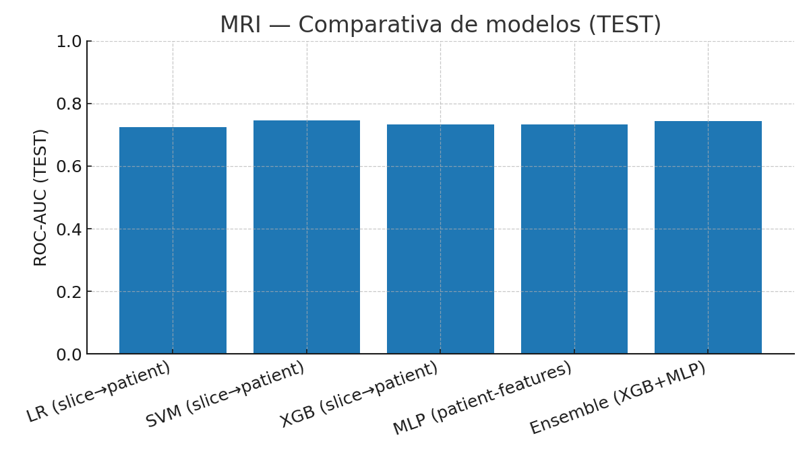
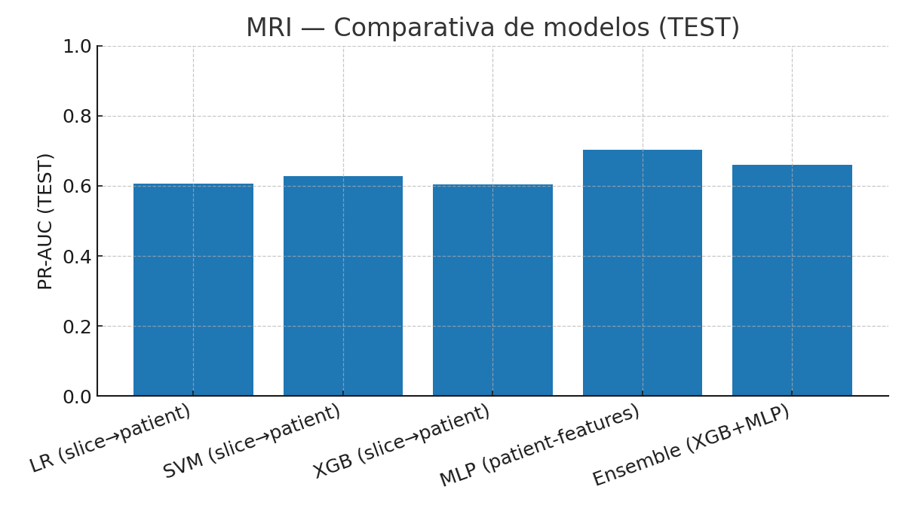
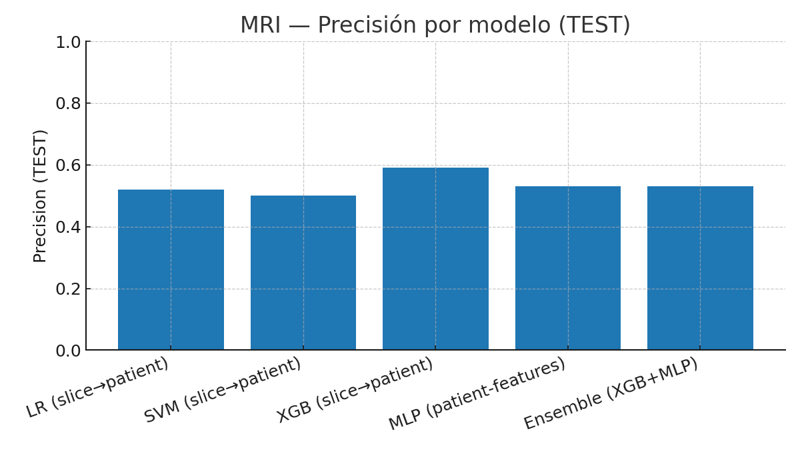
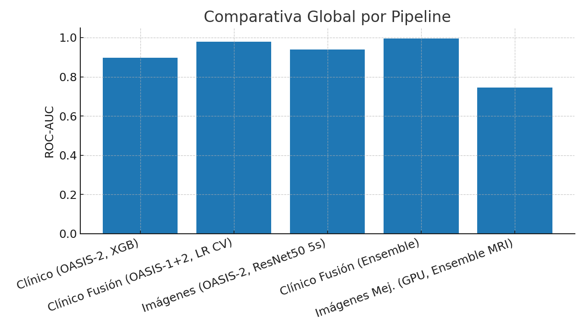
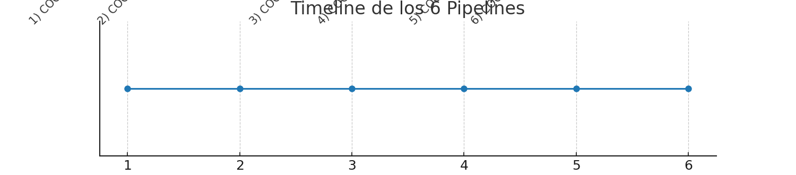

# Informe Técnico — Proyecto COGNITIVA-AI

## 1. Objetivo
Explorar la **detección temprana de Alzheimer** mediante el uso combinado de **datos clínicos tabulares** y **resonancias magnéticas estructurales (MRI)**, replicando el razonamiento clínico.

---

## 2. Datos

### OASIS-1
- 416 sujetos, visita única.  
- Sin variable `Group` → se derivó el target desde **CDR**.  

### OASIS-2
- 150 sujetos, longitudinal.  
- Variables `Group` (`Nondemented`, `Demented`, `Converted`).  

### Unificación
- Target binario (`0=Nondemented`, `1=Demented/Converted`).  
- Control estricto de fugas de información:
  - Clínico → baseline único por paciente.  
  - MRI → splits por paciente/scan_id.  

---

## 3. Pipelines desarrollados

### 3.1 COGNITIVA-AI-CLINIC
- Dataset: OASIS-2.  
- Variables: edad, sexo, educación, SES, MMSE, CDR, eTIV, nWBV, ASF.  
- Modelos: LR, RF, XGB.  
- Resultados: AUC test XGB = 0.897.  

### 3.2 COGNITIVA-AI-CLINIC-IMPROVED
- Fusión OASIS-1+2.  
- Unificación de columnas, selección baseline, target unificado.  
- Validación cruzada: AUC≈0.975.  
- Ensemble: AUC≈0.995.  
- Conclusión: modelos clínicos son robustos y estables.  

### 3.3 COGNITIVA-AI-IMAGES
- Dataset: OASIS-2 MRI.  
- Preprocesamiento: conversión a slices, normalización, augmentations.  
- Modelo: ResNet50 fine-tuning.  
- Resultados:  
  - 5 slices: AUC=0.938.  
  - 20 slices: AUC=0.858.  

### 3.4 COGNITIVA-AI-IMAGES-IMPROVED
- Objetivo: integrar OASIS-1+2 en MRI.  
- Estado: en progreso.  

### 3.5 COGNITIVA-AI-IMAGES-IMPROVED-GPU
- Limitación: entrenamiento local inviable → migración a Google Colab con GPU (T4/A100/L4).  
- Embeddings ResNet18 (512 dim).  
- Clasificador baseline: LR calibrado.  
- Resultados:  
  - Slice-nivel: AUC≈0.66, Brier≈0.23.  
  - Paciente-nivel: Recall≈0.80 con umbral clínico bajo.  

### 3.6 COGNITIVA-AI-IMAGES-IMPROVED-GPU-CALIBRATED
- Clasificadores: SVM, XGB, MLP.  
- Evaluación slice→patient y patient-features.  
- Ensemble híbrido (XGB+MLP).  
- Resultados:  
  - XGB slice→patient: Recall=0.85, Precisión=0.59.  
  - MLP patient-features: PR-AUC=0.703, Recall=0.85.  
  - Ensemble híbrido: AUC=0.744, Recall=0.80, Precisión=0.53.  

---

---

## 3.7 Visualizaciones de resultados

### Comparativa de modelos MRI (paciente-nivel, TEST)

  

  

  

  

**Interpretación**:  
- MLP mejora la calidad de ranking (PR-AUC más alto).  
- XGB conserva la mayor sensibilidad clínica.  
- El ensemble logra el mejor equilibrio general.  

---

### Comparativa Global (ROC-AUC por pipeline)

  

Este gráfico muestra la fortaleza de los modelos clínicos en términos de AUC, y cómo los modelos MRI calibrados en GPU se consolidan como candidatos para fusión multimodal.

---

### Timeline de los 6 Pipelines

  

Este diagrama resume la evolución del proyecto:  
1. Primer baseline clínico.  
2. Fusión clínica OASIS-1+2.  
3. Primer baseline en imágenes.  
4. Ampliación con fusión MRI.  
5. Migración a GPU (Colab).  
6. Calibración y ensembles en GPU.  

---

## 4. Conclusiones Globales

- **Clínico** → modelos muy estables, AUC≈0.98–0.99, interpretables (CDR y MMSE críticos).  
- **MRI baseline** → ResNet50 ofrece alto AUC, dependiente de CPU y preprocesamiento.  
- **MRI mejorado en GPU** →  
  - Modelos calibrados, recall alto.  
  - MLP mejora PR-AUC.  
  - Ensemble híbrido MLP+XGB logra mejor equilibrio global.  

📌 Conclusión:  
- Clínico sigue siendo el más fuerte en AUC.  
- MRI calibrado en GPU es clínicamente relevante (recall≈0.8–0.85, PR-AUC≈0.70).  
- El ensemble híbrido se establece como el modelo MRI recomendado para la futura **fusión multimodal**.  

---

## 5. Próximos pasos

1. Completar la fusión de OASIS-1+2 en imágenes (IMAGES-IMPROVED).  
2. Diseñar y evaluar un modelo multimodal clínico+MRI.  
3. Validación externa con OASIS-3/ADNI.  
4. Publicación académica con énfasis en interpretabilidad clínica.  
