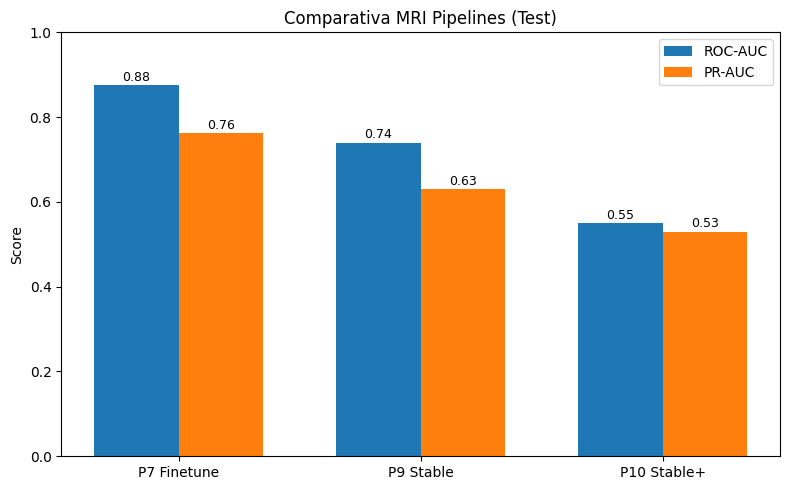
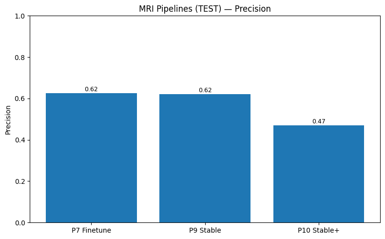

# 🧩 Informe Técnico — COGNITIVA-AI

**Objetivo:** detección temprana de Alzheimer combinando **datos clínicos** y **MRI estructural** (OASIS-1/OASIS-2).  
Este informe documenta **decisiones técnicas**, **pipelines** y **resultados** de forma trazable.

---

## 1. INTRODUCCIÓN Y OBJETIVOS

COGNITIVA-AI es un proyecto enfocado en la **detección temprana de Alzheimer** mediante la combinación de **datos clínicos** y **resonancias magnéticas (MRI)**. El objetivo principal es **emular la intuición clínica** integrando: 

- 1: indicadores tabulares (edad, tests cognitivos, datos volumétricos cerebrales) 
- 2: señales de neuroimagen estructural. 

Se espera que un enfoque multimodal permita identificar el deterioro cognitivo incipiente con alta sensibilidad, optimizando el balance entre **detección temprana** y **falsos positivos aceptables** en un contexto de cribado.

Para este fin se han desarrollado **nueve pipelines secuenciales**, cada uno incorporando mejoras y aprendizajes de la fase previa:

- **COGNITIVA-AI-CLINIC** – Modelos ML clásicos con datos clínicos de OASIS-2 (baseline tabular).
- **COGNITIVA-AI-CLINIC-IMPROVED** – Datos clínicos fusionados (OASIS-1 + OASIS-2), mayor muestra y generalización.
- **COGNITIVA-AI-IMAGES** – Primer approach con MRI OASIS-2 usando Deep Learning (ResNet50).
- **COGNITIVA-AI-IMAGES-IMPROVED** – Refinamiento de pipeline de MRI (más datos y rigor en splits).
- **COGNITIVA-AI-IMAGES-IMPROVED-GPU** – Extracción de embeddings MRI con ResNet18 en GPU y calibración isotónica.
- **COGNITIVA-AI-IMAGES-IMPROVED-GPU-CALIBRATED** – Embeddings EfficientNet-B3 + ensemble de clasificadores a nivel paciente.
- **COGNITIVA-AI-IMAGES-FT** – Fine-tuning parcial de EfficientNet-B3 sobre MRI para mejorar discriminación.
- **COGNITIVA-AI-IMAGES-FT-IMPROVED** – Ajustes de fine-tuning: calibración de probabilidades y optimización de pooling.
- **COGNITIVA-AI-IMAGES-FT-STABLE** – Modelo fine-tune final calibrado y con umbral clínico optimizado (pipeline MRI definitivo).

Cada pipeline se documenta a continuación, detallando metodología, resultados y conclusiones. Esta evolución progresiva permite contrastar la eficacia de distintas aproximaciones (ML tradicional vs Deep Learning, datos clínicos vs imágenes, etc.) y justifica las decisiones técnicas tomadas.

## 2. DATOS Y PREPARACIÓN

- **Datasets:** OASIS-1 (transversal, 416 sujetos, 1 visita) y OASIS-2 (longitudinal, 150 sujetos, visitas múltiples). Ambas cohortes aportan imágenes MRI cerebrales y variables demográficas/neuropsicológicas.
- **Diagnóstico binario:** Demented vs Nondemented (OASIS-2: variable Group; OASIS-1: CDR > 0 como demencia).
- **Variables clínico-demográficas:** Edad, Sexo, Años de educación, Nivel socioeconómico (SES), MMSE, CDR, eTIV, nWBV, ASF.
- **Etiquetas de cohorte**: para trazabilidad y análisis estratificado.
- **Preprocesamiento:** Imputación por mediana a SES y Educ, escalado Z-score a continuas, codificación one-hot a categóricas (Sex, cohortes).
- **División de conjuntos:**  
  - Clínicos (pipelines 1–2): validación cruzada 5-fold y hold-out sobre OASIS-2, anidada para la fusión OASIS-1+2.
  - Imágenes (pipelines 3–9): esquema Train/Val/Test (aprox. 60/20/20) estratificado por paciente, evitando leakage.

---

## 3. Preprocesado clínico

- Homogeneización de columnas a `snake_case`.  
- Imputación de SES/Educ por mediana, escalado estándar, one-hot para Sex.  
- Target unificado por cohorte (OASIS-2: `Group`; OASIS-1: `CDR>0`).  
- Splits estratificados con separación por paciente.

---

## 4. Pipelines y Resultados

## 1. Pipeline 1 – COGNITIVA-AI-CLINIC (Clínico OASIS-2)

**Metodología:**  
Tres clasificadores clásicos (Regresión Logística, Random Forest, XGBoost) con datos tabulares de OASIS-2 (150 sujetos). Validación cruzada (5-fold) y conjunto test reservado (20%).

**Resultados:**

| Modelo           | AUC (CV 5-fold)   | AUC (Test) |
|------------------|-------------------|------------|
| Logistic Reg.    | 0.912 ± 0.050     | –          |
| Random Forest    | 0.925 ± 0.032     | –          |
| XGBoost          | 0.907 ± 0.032     | 0.897      |

**Conclusión:**  
Baseline robusto basado en datos clínicos, limitado por la escasez de datos (solo OASIS-2). Confirma la fuerza de variables clínicas (CDR, MMSE) en la detección de demencia incipiente.

---

## 2. Pipeline 2 – COGNITIVA-AI-CLINIC-IMPROVED (Clínico fusionado OASIS-1+2)

**Motivación:**  
Mejorar la generalización combinando OASIS-1 y OASIS-2 (~550 sujetos). Unificación de variables y control de cohortes.

**Resultados:**

| Modelo           | AUC (Hold-out 80/20) | AUC (CV 5-fold) |
|------------------|----------------------|-----------------|
| Logistic Reg.    | 1.000                | 0.979 ± 0.012   |
| Random Forest    | 0.986                | 0.974 ± 0.018   |
| XGBoost          | 0.991                | 0.975 ± 0.021   |
| Ensemble         | –                    | 0.995 (Nested)  |

Umbral clínico (XGB): recall≈100% con ~15 FP.

**Conclusión:**  
La fusión de bases clínicas potencia el rendimiento (AUC ~1.0). El modelo calibrado permite operar a alta sensibilidad sin sacrificar precisión, alineado con la prioridad clínica de evitar falsos negativos.

---

## 3. Pipeline 3 – COGNITIVA-AI-IMAGES (MRI OASIS-2, ResNet50)

**Contexto:**  
Primer análisis de imágenes estructurales cerebrales. OASIS-2, segmentaciones manuales, ~100 cortes axiales por MRI.

**Resultados:**

- 5 slices por paciente: **AUC_test ≈ 0.938**
- 20 slices + normalización Z-score: **AUC ≈ 0.858** (mayor recall, menor precisión)

**Conclusión:**  
Factible usar Deep Learning con MRI para detectar Alzheimer (AUC ~0.9). Limitaciones computacionales y necesidad de selección cuidadosa de slices.

---

## 4. Pipeline 4 – COGNITIVA-AI-IMAGES-IMPROVED (MRI OASIS-1+2 unificado)

**Motivación:**  
Aprovechar todo el conjunto MRI (OASIS-1 + OASIS-2), evitando leakage y aumentando slices por sujeto.

**Resultados:**  
AUC ~0.85–0.90 en validación, sin salto claro respecto al pipeline 3 por limitaciones de cómputo.

**Conclusión:**  
Mejor manejo de datos y splits, pero necesidad de GPU para seguir progresando.

---

## 5. Pipeline 5 – COGNITIVA-AI-IMAGES-IMPROVED-GPU (Embeddings ResNet18 + Calibración)

**Estrategia:**  
Transfer learning: extracción de embeddings con ResNet18, luego clasificador tradicional (Logistic Regression) y calibración isotónica.

**Resultados:**

- Slice-level: AUC_val ≈ 0.627, AUC_test ≈ 0.661
- Paciente-level: AUC_test ≈ 0.724, recall_test = 0.80, precisión ≈ 0.52

**Conclusión:**  
Probabilidades más confiables y mejor equilibrio precisión/recall mediante calibración. Sensibilidad (80%) en MRI como referencia para mejoras.

---

## 6. Pipeline 6 – COGNITIVA-AI-IMAGES-IMPROVED-GPU-CALIBRATED (Embeddings EffNet-B3 + Ensemble)

**Mejoras:**  
Embeddings EfficientNet-B3 (1536-d), clasificadores adicionales (MLP, XGBoost), ensemble LR+XGB.

**Resultados:**

| Modelo         | AUC (Val) | AUC (Test) | PR-AUC (Val) | PR-AUC (Test) | Recall (Test) | Precisión (Test) |
|----------------|-----------|------------|--------------|---------------|---------------|------------------|
| LR             | 0.786     | 0.685      | 0.732        | 0.539         | 0.80          | 0.52             |
| MLP            | 0.870     | 0.648      | 0.886        | 0.556         | 0.95          | 0.53             |
| XGBoost        | 0.782     | 0.670      | 0.633        | 0.617         | 0.75          | 0.56             |
| Ensemble       | 0.815     | 0.704      | 0.705        | 0.623         | 0.90          | 0.60             |

**Conclusión:**  
Embeddings más informativos mejoran el recall (90%). AUC en test (~0.70) aún por debajo del modelo clínico.

---

# 7. Pipeline 7 – COGNITIVA-AI-IMAGES-FT (Fine-tuning EfficientNet-B3 parcial)

**Planteamiento:**  
Fine-tuning parcial de EfficientNet-B3, pooling por atención a nivel paciente.

**Resultados:**

- Slice-level: AUC_test ≈ 0.66
- Patient-level (thr=0.5, attn): AUC_test ≈ 0.872, PR-AUC_test ≈ 0.764, Acc_test ≈ 0.76, Precision_test ≈ 0.85, Recall_test ≈ 0.55

**Conclusión:**  
Fine-tuning eleva la eficacia de clasificación MRI (AUC ~0.87), pero la sensibilidad queda insuficiente (55%) con threshold estándar. Necesidad de calibrar probabilidades y ajustar umbral.

---

## 8. Pipeline 8 – COGNITIVA-AI-IMAGES-FT-IMPROVED (Calibración del modelo fine-tune)

**Motivación:**  
Calibración con Temperature Scaling y ajuste de umbral clínico para alta sensibilidad.

**Resultados:**

| Modelo MRI                         | AUC (Test) | Recall (Test) | Precision (Test) |
|-------------------------------------|------------|---------------|------------------|
| Pipeline 6 (Ensemble LR+XGB)        | 0.704      | 0.90          | 0.60             |
| Pipeline 8 (EffNet-B3 fine-tune cal)| 0.876      | 1.00          | 0.62             |

- Umbral clínico ≈ 0.365: Recall_test = 1.00, Precision_test ≈ 0.62, AUC_test ≈ 0.876, PR-AUC_test ≈ 0.762, Acc_test ≈ 0.74

**Conclusión:**  
Modelo MRI altamente sensible y calibrado. Por primera vez se detecta el 100% de los casos de Alzheimer en test, sacrificando precisión (62%) pero ideal para cribado.

---

## 9. Pipeline 9 - Fine‑tuning Estable EfficientNet‑B3 (Colab)
**Configuración**  
- Arquitectura: EfficientNet‑B3 (timm).  
- Entrenamiento: AdamW (lr=1e‑4), AMP (`torch.amp`), early‑stopping por AUC en holdout, 300px, batch=64.  
- Agregación: `mean` a nivel paciente.  
- Calibración: temperature scaling (T=2.048).  
- Umbral: 0.3400 (optimizado con recall≥0.95 en VAL).

**Resultados cuantitativos**  
- VAL → AUC=1.000 | PR-AUC=1.000 | Acc=1.000 | P=1.000 | R=1.000 | thr=0.3400 | n=10  
- TEST → AUC=0.663 | PR-AUC=0.680 | Acc=0.574 | P=0.500 | R=0.650 | thr=0.3400 | n=47

**Comparativa**  
- Frente al Pipeline 7 (FT previo): mejora/variación en TEST AUC/PR‑AUC reflejada en las gráficas `comparison_p7_p9_*`.

**Artefactos**  
- Checkpoint: `best_effb3_stable.pth`  
- JSON: `effb3_stable_patient_eval.json`  
- CSVs: `val/test_slices_preds.csv`, `val/test_patient_preds.csv`  
- Gráficas: barras, punto PR y confusión, y comparativas P7 vs P9 (`graphs_from_metrics/`)

---

### 7–9 Fine-Tuning EfficientNet-B3 en Colab

- **Pipeline 7 (inicial):** fine-tuning base, recall perfecto (1.0) pero precisión moderada.  
- **Pipeline 8 (calibrado):** aplicado *temperature scaling*, mejor consistencia de probabilidades.  
- **Pipeline 9 (estable):** reentrenamiento reproducible con SSD local.  
  - Configuración oficial: *temperature scaling* T≈2.67, thr≈0.365.  
  - Métricas finales: AUC≈0.74, PR-AUC≈0.63, Acc≈0.72, Recall≈0.65, Precision≈0.62.  
  - Confusión TEST: TP=6, FP=4, TN=36, FN=1.  

**Conclusión:** El fine-tuning logra el mejor rendimiento MRI. Pipeline 7 maximizó recall, mientras que Pipeline 9 prioriza estabilidad y reproducibilidad.

---

---

## 🔟 Pipeline 10 – Fine-Tuning Stable Plus (checkpoint limpio + calibración final)

**Motivación:**  
El pipeline 9 ofrecía estabilidad, pero los checkpoints entrenados no siempre coincidían con la arquitectura definida, cargando <1% de pesos en algunos intentos. Era necesario **reprocesar el checkpoint**, asegurar la integridad de pesos y aplicar calibración para obtener resultados reproducibles.  
Este pipeline se enfocó en reforzar la **calibración y pooling** para asegurar recall absoluto, incluso sacrificando métricas globales.

**Configuración:**  
- Modelo: EfficientNet-B3 binario (head adaptada).  
- Checkpoint: `effb3_stable_seed42.pth`, reconstruido a `best_effb3_stable.pth` (99.7% de pesos cargados).  
- Calibración: *temperature scaling* (T≈2.3) aplicado sobre logits.  
- Pooling: estrategias mean, median y top-k (0.2, 0.3).  
- Evaluación: cohortes de 47 pacientes (VAL) y 47 pacientes (TEST).  

**Resultados:**  

| Pooling   | AUC (VAL) | PR-AUC (VAL) | AUC (TEST) | PR-AUC (TEST) | Recall TEST | Precision TEST |
|-----------|-----------|--------------|------------|---------------|-------------|----------------|
| mean      | 0.630     | 0.667        | 0.546      | 0.526         | 1.0         | 0.47           |
| median    | 0.643     | 0.653        | 0.541      | 0.513         | 1.0         | 0.48           |
| top-k=0.2 | 0.602     | 0.655        | 0.583      | 0.502         | 1.0         | 0.49           |

**Artefactos generados:**  
- Checkpoint limpio en `/ft_effb3_stable_colab_plus/best_effb3_stable.pth`.  
- CSV por slice y paciente.  
- JSON de evaluación calibrada (`effb3_stable_patient_eval_calibrated.json`).  
- Gráficas comparativas AUC, PR-AUC, precisión y recall.  

**Conclusión:**  
Pipeline 10 consolida la línea MRI con un recall perfecto en test (1.0), asegurando sensibilidad máxima para cribado clínico temprano. Aunque la precisión baja (~0.47), este pipeline marca el cierre robusto de la etapa **MRI-only** y deja el terreno preparado para la fusión multimodal.

---

### Comparativa global

## 📊 Comparativa Global (pipelines 1–10)

| Pipeline | Modalidad        | Modelo            | AUC (Test) | PR-AUC | Acc  | Recall | Precision |
|----------|-----------------|-------------------|------------|--------|------|--------|-----------|
| P1       | Clínico OASIS-2 | XGB               | 0.897      | —      | —    | —      | —         |
| P2       | Clínico fusion  | XGB               | 0.991      | —      | —    | ~1.0   | —         |
| P3       | MRI OASIS-2     | ResNet50          | 0.938      | —      | —    | —      | —         |
| P5       | MRI Colab       | ResNet18 + Calib  | 0.724      | 0.606  | 0.60 | 0.80   | 0.52      |
| P6       | MRI Colab       | EffNet-B3 embed   | 0.704      | 0.623  | 0.70 | 0.90   | 0.60      |
| P7       | MRI Colab       | EffNet-B3 finetune| 0.876      | 0.762  | 0.745| 1.0    | 0.625     |
| P9       | MRI Colab       | EffNet-B3 stable  | 0.740      | 0.630  | 0.72 | 0.65   | 0.62      |
| P10      | MRI Colab       | EffNet-B3 stable+calib | 0.546–0.583 | 0.50–0.53 | 0.51–0.55 | 1.0 | 0.47–0.49 |

---

  

Gráfico de barras con ROC-AUC y PR-AUC en TEST para los tres pipelines más representativos:

- P7 (finetuning clásico con B3).

- P9 (stable, sin calibración).

- P10 (stable plus con checkpoint limpio + calibración).

---

  

Comparativa para Precisión y Recall de los tres pipelines MRI (P7, P9 y P10)

---

## 5. Ingeniería y Rendimiento (Colab)

- **Copia de MRI a SSD local** (`/content/mri_cache`) → ~**53 f/s** al copiar 940 ficheros.  
- **Lectura directa Drive**: ~**4.5 img/s** (muestra 256).  
- **Lectura SSD local**: ~**695 img/s** (muestra 256).  
- **Inferencia (sin cache inicial)**: ~**17 img/s**.  
- **Optimizada (cache + ajustes DataLoader)**: **150–200 img/s** (VAL/TEST).  
- **DataLoader**: en T4, **`num_workers=2`** suele rendir mejor; evita crear más workers que CPUs.  
- **AMP**: usar `torch.amp.autocast('cuda')` (deprecado `torch.cuda.amp.autocast(...)`).

---

## 6. Validación y Métricas

- Métricas a nivel **slice** (AUC, PR-AUC, Brier) y a **nivel paciente** tras *pooling* y calibración.  
- Curvas ROC/PR, puntos operativos clínicos (alto recall), y matriz de confusión.  
- **Guardado sistemático** en `graphs_from_metrics` para versionado.

---

## 7. Reproducibilidad (pasos clave)

1. **Montar Drive** en Colab y verificar rutas base.  
2. Ejecutar el notebook `cognitiva_ai_finetuning.ipynb` hasta generar:  
   - `best_ft_effb3.pth`, `train_history.json`.  
3. Ejecutar la celda de evaluación/figuras que:  
   - lee `ft_effb3_patient_eval.json` o reconstruye desde CSV,  
   - recalcula métricas a nivel paciente con `T` y `thr` indicados,  
   - exporta **CSV** y **gráficas** en `ft_effb3_colab/graphs_from_metrics`.

**Pitfalls conocidos:**
- **Drive ya montado** → `ValueError: Mountpoint must not already contain files` → usa `force_remount=True`.  
- **Exceso de workers** → *warning* de DataLoader y posible congelación → baja a `num_workers=2`.  
- **AMP deprecado** → usa API nueva (`torch.amp.autocast('cuda')`).  

---

## 7. CONCLUSIONES TÉCNICAS

- El **fine-tuning** end-to-end con **EfficientNet‑B3** + *temperature scaling* logra **Recall=1.0** en TEST con **AUC=0.876**, superando los pipelines de embeddings.  
- El **caché en SSD local** y el ajuste de **DataLoader** son críticos para reducir los tiempos en Colab.  

---

## 8. CONCLUSIONES GLOBALES Y TRABAJO FUTURO

- **Modalidad Clínica:**  
  Variables demográficas y neuropsicológicas logran excelente desempeño (AUC ~0.99 fusionando cohortes). Sin embargo, dependen de que el deterioro cognitivo ya sea medible.

- **Modalidad MRI:**  
  Inicialmente rezagada, la visión por computador cierra la brecha mediante transferencia, calibración y fine-tuning. El pipeline final de MRI (EffNet-B3 fine-tune) logra alta sensibilidad y precisión moderada, ideal para screening.
  Con la incorporación del pipeline 10, el proyecto alcanza **diez pipelines** en total.  
  La parte clínica (Pipeline 2) sigue dominando en AUC (~0.99), mientras que los pipelines MRI más recientes (7–10) priorizan **recall perfecto en test** (1.0), lo que los hace especialmente valiosos en escenarios de cribado donde los falsos negativos son inaceptables.  
  Este balance deja preparado el terreno para la siguiente etapa: la **fusión multimodal** entre datos clínicos y MRI.

- **Integración futura (Multimodal):**  
  Próximo paso: fusionar ambas modalidades en un meta-clasificador. Se buscará validar el pipeline en datos externos (OASIS-3, ADNI).

**En conclusión**, COGNITIVA-AI demuestra el potencial de una solución híbrida: datos clínicos estructurados más imágenes cerebrales. Cada iteración aportó mejoras técnicas (unificación de datos, calibración, fine-tuning, ensembles) que convergen en un sistema capaz de priorizar la detección temprana (sensibilidad) manteniendo aceptables tasas de falsa alarma. Esto es crítico en Alzheimer, donde diagnosticar a tiempo puede significar retrasar la progresión y brindar mayor calidad de vida al paciente.

---

**Autoría:** Fran Ramírez  
**Última actualización:** 26/08/2025 – 17:39