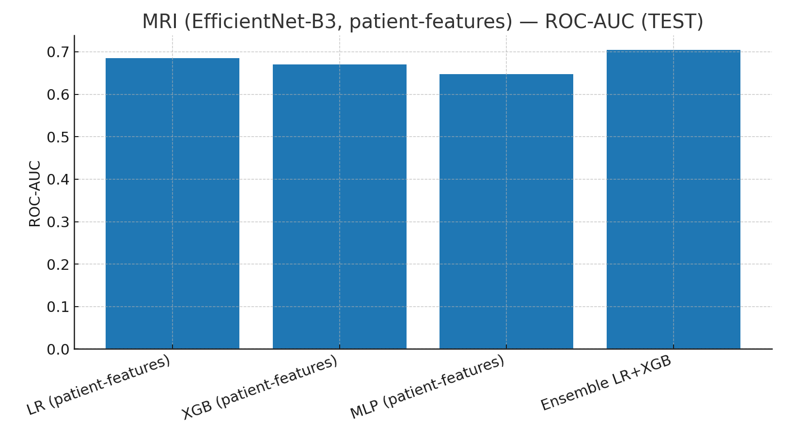
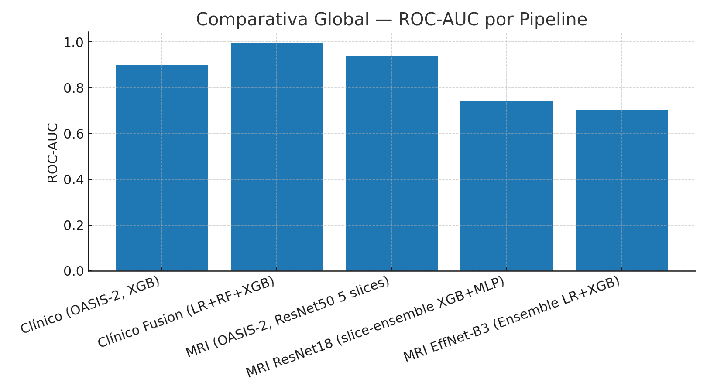

# Informe Técnico — Proyecto COGNITIVA-AI

## Introducción

El Alzheimer es una enfermedad neurodegenerativa progresiva que afecta la memoria y otras funciones cognitivas.  
La **detección temprana** es crucial para intervenciones más efectivas, y puede abordarse desde:  

1. **Datos clínicos tabulares** (tests neuropsicológicos, factores de riesgo, medidas volumétricas).  
2. **Imágenes de resonancia magnética estructural (MRI)**, que reflejan atrofia cerebral.  

Este proyecto emplea datos de **OASIS-1 y OASIS-2**, explorando ambas modalidades.  

---

## Datos y Variables

- **OASIS-1 (transversal):** 416 sujetos, una visita.  
- **OASIS-2 (longitudinal):** 150 sujetos, múltiples visitas.  

**Variables clínicas:**

- **Age**: Edad del paciente. Predictor fuerte de riesgo.  
- **Sex**: Diferencias epidemiológicas en prevalencia.  
- **Educ**: Años de educación formal. Relacionado con reserva cognitiva.  
- **SES**: Escala socioeconómica. Asociada a recursos cognitivos.  
- **MMSE**: Test cognitivo global (0–30).  
- **CDR**: Escala clínica de severidad de demencia.  
- **eTIV**: Volumen intracraneal estimado.  
- **nWBV**: Proporción de volumen cerebral respecto intracraneal.  
- **ASF**: Factor de ajuste anatómico.  

**MRI:** imágenes `.hdr/.img` + segmentaciones asociadas.  

**Target unificado:**  
- `0 = Nondemented`  
- `1 = Demented` o `Converted`.  

---

## Metodología

- **Control de fugas:** baseline OASIS-2, split por paciente en MRI.  
- **Pipelines clínicos:** LR, RF, XGB.  
- **Pipelines MRI:** ResNet50, ResNet18, EfficientNet-B3.  
- **Estrategias de calibración:** isotónica.  
- **Evaluación a nivel slice y paciente.**  

---

## Resultados

### Clínico (OASIS-2)
- XGBoost: **AUC=0.897 (test)**.  

### Clínico Fusionado (OASIS-1+2)
- Ensemble (LR+RF+XGB): **AUC≈0.995**.  
- Muy estable, alta generalización.  

### MRI ResNet50 (OASIS-2 baseline)
- 5 slices → **AUC=0.938 (test)**.  

### MRI ResNet18 (Colab GPU calibrado)
- Slice: AUC≈0.66, Brier=0.23.  
- Paciente: Recall=0.80, Precision=0.52 (test).  

### MRI EfficientNet-B3 (patient-features + ensemble)
- Ensemble LR+XGB:  
  - [VAL] AUC=0.815 | PR-AUC=0.705 | Recall=0.95.  
  - [TEST] AUC=0.704 | PR-AUC=0.623 | Recall=0.90.  

---

## Visualizaciones

  

  

  

  

  

---

## Comparativa Global

  

---

## Conclusiones

- Los modelos clínicos siguen siendo los **más fiables (AUC≈0.98–0.99)**.  
- MRI ResNet18 calibrado mejora la confiabilidad probabilística (Brier).  
- MRI EfficientNet-B3 + ensemble logra **sensibilidad clínica alta (R≈0.9)**.  
- Estrategia general: priorizar recall (detección temprana) frente a precisión.  
- Próximos pasos: **fusión multimodal clínico+MRI** y validación externa en OASIS-3/ADNI.  

---

**Autoría:** Fran Ramírez  
**Año:** 2025

