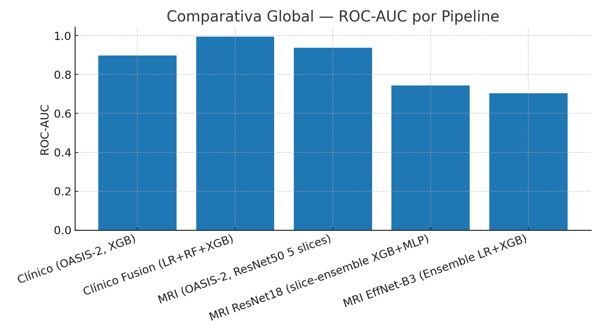
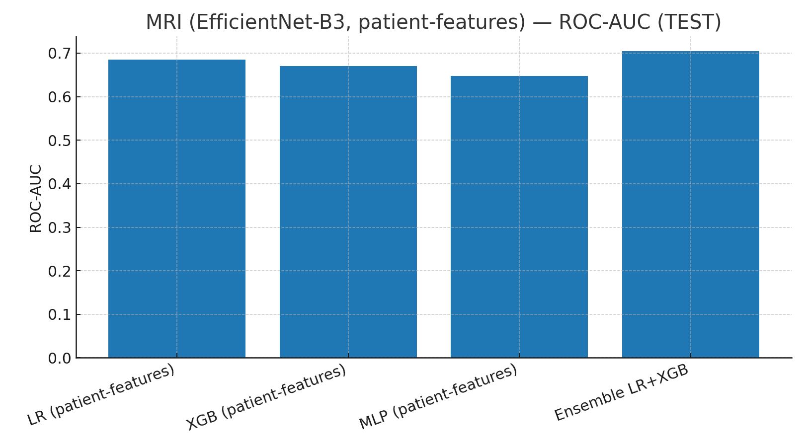
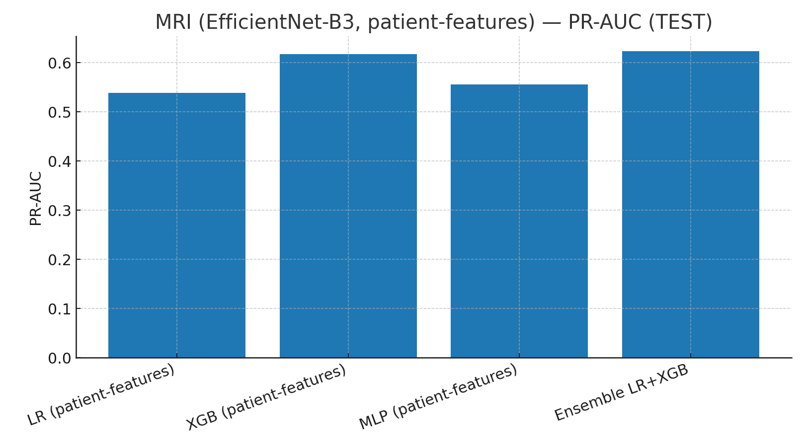
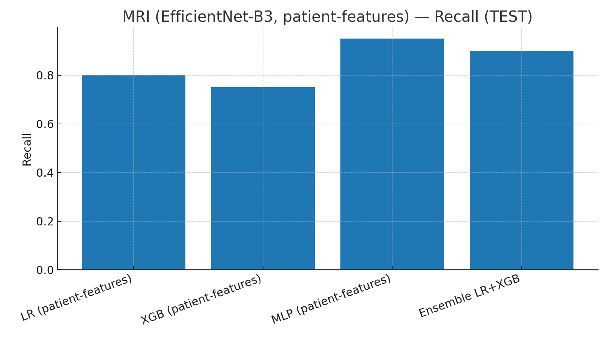
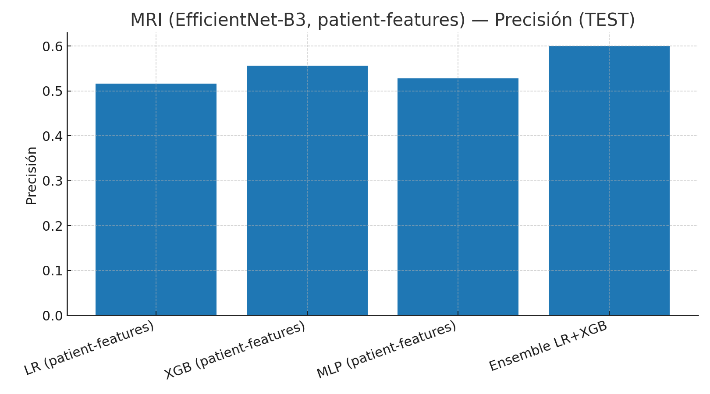
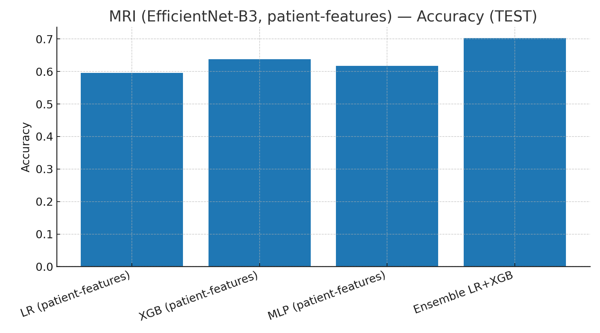

# 🧠 Proyecto de Detección Temprana de Alzheimer (COGNITIVA-AI)

Este proyecto explora la **detección temprana de la enfermedad de Alzheimer** combinando **datos clínicos tabulares** y **resonancias magnéticas estructurales (MRI)** de los conjuntos **OASIS-1 y OASIS-2**.  

El enfoque se diseñó con una idea central: **replicar el razonamiento clínico** usando tanto la información disponible en la historia del paciente (tests neuropsicológicos, edad, educación, volumen cerebral) como en las **imágenes estructurales cerebrales**.  

Se construyeron **diez pipelines** para analizar y comparar modalidades:  

1. **COGNITIVA-AI-CLINIC** → ML clásico con datos clínicos (solo OASIS-2).  
2. **COGNITIVA-AI-CLINIC-IMPROVED** → ML clásico con datos clínicos fusionados OASIS-1 + OASIS-2.  
3. **COGNITIVA-AI-IMAGES** → Deep Learning con MRI (solo OASIS-2, ResNet50).  
4. **COGNITIVA-AI-IMAGES-IMPROVED** → fusión de OASIS-1+2 en imágenes.  
5. **COGNITIVA-AI-IMAGES-IMPROVED-GPU (ResNet18)** → embeddings ResNet18 entrenados en **Google Colab (GPU)**.  
6. **COGNITIVA-AI-IMAGES-IMPROVED-GPU-CALIBRATED (EffNet-B3)** → embeddings EfficientNet-B3 + ensemble LR+XGB a nivel paciente.  
7. **COGNITIVA-AI-FINETUNING** → Fine-tuning directo de EfficientNet-B3 en **Google Colab (GPU)** con *temperature scaling* y agregación a **nivel paciente**.  
8. **COGNITIVA-AI-FINETUNING-IMPROVED**  → Mejoras de fine-tuning (calibración de probabilidades).
9. **COGNITIVA-AI-FINETUNING-STABLE** → Retraining estable de EfficientNet-B3 en **Google Colab (GPU)** con caché SSD, *temperature scaling* y selección de umbral clínico (recall≥0.95).
10. **COGNITIVA-AI-FINETUNING-STABLE-PLUS** → checkpoint limpio + calibración final

---

## 📦 Datos y Variables Clínicas

Los datos provienen de los proyectos **OASIS-1** y **OASIS-2**:

- **OASIS-1 (transversal):** 416 sujetos, una sola visita por paciente.  
  - No tiene variable `Group`, la severidad se deduce a partir de **CDR** (`0=No demencia`, `>0=Demencia`).  

- **OASIS-2 (longitudinal):** 150 sujetos, múltiples visitas.  
  - Incluye `Group` (`Nondemented`, `Demented`, `Converted`).  

**Variables clínicas empleadas:**

- **Age** → Edad del paciente en la visita inicial. Factor de riesgo primario en Alzheimer.  
- **Sex** → Sexo biológico. El Alzheimer presenta prevalencias distintas en mujeres.  
- **Educ** → Años de educación formal. Factor protector (mayor reserva cognitiva).  
- **SES** (Socioeconomic Status) → Escala 1–5 (mayor valor = mayor estatus). Se ha relacionado con acceso a recursos cognitivos.  
- **MMSE** (Mini-Mental State Examination) → Test neuropsicológico de 0–30. Valores bajos indican deterioro cognitivo.  
- **CDR** (Clinical Dementia Rating) → Escala clínica (0=normal, 0.5=mild, 1=moderate, 2–3=severe). Considerado estándar de oro para diagnóstico.  
- **eTIV** (Estimated Total Intracranial Volume) → Volumen craneal estimado, usado para normalizar medidas volumétricas.  
- **nWBV** (Normalized Whole Brain Volume) → Proporción de volumen cerebral respecto al intracraneal. Refleja atrofia cerebral.  
- **ASF** (Atlas Scaling Factor) → Factor de escalado anatómico aplicado en el registro.  

Estas variables combinan **información clínica y volumétrica**, proporcionando una visión integral de factores de riesgo y biomarcadores estructurales.

---

# 1️⃣ COGNITIVA-AI-CLINIC (solo OASIS-2)

- **Preprocesamiento**: imputación SES/Educación por mediana, escalado estándar, codificación one-hot.  
- **Modelos**: Logistic Regression, Random Forest, XGBoost.  

### 📊 Resultados
- Regresión Logística → **0.912 ± 0.050 (CV)**  
- Random Forest → **0.925 ± 0.032 (CV)**  
- XGBoost → **0.907 ± 0.032 (CV)**  
- Mejor en test: **XGBoost = 0.897 AUC**  

➡️ Primer baseline, estable pero dataset reducido (150 sujetos).  
---

# 2️⃣ COGNITIVA-AI-CLINIC-IMPROVED (fusión OASIS-1 + OASIS-2)

- **Unificación de columnas** (`snake_case`).  
- **Selección baseline** en OASIS-2.  
- **Target unificado**: `Group` (OASIS-2) o `CDR` (OASIS-1).  
- **Etiquetas de cohortes** para trazabilidad.  

### 📊 Resultados
- **Hold-out inicial (80/20):** LogReg=1.000 | RF=0.986 | XGB=0.991  
- **Validación cruzada (5-fold):**  
  - LogReg → **0.979 ± 0.012**  
  - RF → **0.974 ± 0.018**  
  - XGB → **0.975 ± 0.021**  

➡️ Modelos muy estables con excelente generalización.  

**Umbral clínico (XGB):** recall≈100% con 15 falsos positivos.
**Interpretación:** mejor tolerar falsos positivos que falsos negativos.

---

# 3️⃣ COGNITIVA-AI-IMAGES (MRI OASIS-2)

- **Pipeline**: conversión `.hdr/.img` a slices, normalización, augmentations ligeros.  
- **Modelo**: ResNet50 fine-tuning.  

### 📊 Resultados
- 5 slices → **AUC=0.938 (test)**  
- 20 slices + z-score → AUC=0.858 (mayor recall, menor precisión).  

➡️ Buen baseline, costoso en CPU.  

---

# 4️⃣ COGNITIVA-AI-IMAGES-IMPROVED (MRI OASIS-1)

- **Split paciente/scan** estricto.  
- **Más slices** por paciente.  

### 📊 Resultados
- Pipeline más robusto, pero alto coste computacional en CPU.  

---

# 5️⃣ COGNITIVA-AI-IMAGES-IMPROVED-GPU (ResNet18 + Calibración)

- **Embeddings ResNet18 (512D)**.  
- Clasificación con **Logistic Regression**.  
- **Calibración isotónica**.  

### 📊 Resultados
- **Slice-nivel:** AUC≈0.66 | Brier≈0.23.  
- **Paciente-nivel (thr≈0.20, recall≥0.90):**  
  - [VAL] Recall=0.90 | Precision=0.60 | AUC=0.722  
  - [TEST] Recall=0.80 | Precision=0.52 | AUC=0.724  

➡️ Probabilidades más confiables tras calibración.  

---

# 6️⃣ COGNITIVA-AI-IMAGES-IMPROVED-GPU-CALIBRATED (EffNet-B3)

- **Embeddings EfficientNet-B3 (1536D)**.  
- Modelos: LR, XGB, MLP a nivel paciente.  
- **Ensemble LR+XGB** ponderado por PR-AUC.  

### 📊 Resultados
- [VAL] AUC=0.815 | PR-AUC=0.705 | Recall=0.95 | Acc=0.70  
- [TEST] AUC=0.704 | PR-AUC=0.623 | Recall=0.90 | Acc=0.70  

➡️ Mejor pipeline MRI hasta la fecha, con sensibilidad alta.  

---

# 7️⃣ COGNITIVA-AI-FINETUNING (EfficientNet-B3 Fine-Tuning parcial)

- **Notebook:** `cognitiva_ai_finetuning.ipynb` (Colab GPU)  
- **Modelo:** EfficientNet-B3 pre-entrenado (Imagenet) con última(s) capas descongeladas y reentrenadas sobre MRI OASIS-2.
- **Entrenamiento:** Google Colab GPU (T4), early stopping guiado por PR-AUC en validación.
- **Pooling por paciente:** pruebas con promedio vs. atención (pesos por importancia de slice).  
- **Calibración:** *temperature scaling* con **T=2.673**  
- **Umbral clínico:** **0.3651**  
- **Artefactos generados:**  
  - `ft_effb3_colab/best_ft_effb3.pth`  
  - `ft_effb3_colab/train_history.json`  
  - `ft_effb3_colab/ft_effb3_patient_eval.json`  
  - `ft_effb3_colab/graphs_from_metrics/…`

### 📊 Resultados finales (nivel paciente, n=47)
- **VAL** → AUC=**0.748** | PR-AUC=**0.665** | Acc=**0.702** | Precision=**0.588** | Recall=**1.0**  
- **TEST** → AUC=**0.876** | PR-AUC=**0.762** | Acc=**0.745** | Precision=**0.625** | Recall=**1.0**  

**Matriz de confusión TEST (reconstruida, thr=0.3651):**  
**TP=8, FP=5, TN=34, FN=0**

- **Desempeño bruto (thr=0.5):** VAL AUC≈0.75 | PR-AUC≈0.66; TEST AUC≈0.87 | PR-AUC≈0.76
- **Recall por defecto (thr=0.5):** bajo en VAL (~0.40) y TEST (~0.55) con precisión alta (~0.85 test), indicando muchos casos positivos omitidos.

➡️ El fine-tuning mejora sustancialmente la discriminación (AUC) respecto a pipelines previos (AUC_test ~0.87 vs ~0.70 en pipeline 6), pero con umbral estándar aún no alcanza sensibilidad adecuada (recall 55% en test).

### 🖼️ Gráficas (generadas desde métricas)
- `graphs_from_metrics/ft_b3_patient_confusion_from_metrics.png`  
- `graphs_from_metrics/ft_b3_pr_point.png`  
- `graphs_from_metrics/ft_b3_bars_auc.png`  
- `graphs_from_metrics/ft_b3_bars_prauc.png`  

---

# 8️⃣ COGNITIVA-AI-IMAGES-FT-IMPROVED (Calibración y ajustes Fine-tune)

- **Calibración de probabilidades:**  se aplicó `Temperature Scaling` en validación para corregir el sesgo de confianza del modelo (evitando técnicas prefit con riesgo de fuga de datos).
- **Pooling óptimo:** la agregación por *atención* superó ligeramente al promedio en métricas de validación (PR-AUC), por lo que se adoptó para el pipeline final.
- **Métricas calibradas:** tras calibración, las predicciones resultaron más fiables (mejor Brier Score y distribución probabilística más alineada).

📊 Resultados:
- **VAL (calibrado, attn):** AUC≈0.75 | PR-AUC≈0.66 (similar a bruto, señal consistente).
- **TEST (calibrado, attn):** AUC≈0.88 | PR-AUC≈0.76 (sin cambio notable en AUC, confirma generalización).
- **Nota:** La calibración no altera el AUC, pero asegura que las probabilidades reflejen riesgo real. Se observó mejora cualitativa en la confiabilidad de las predicciones.

➡️ La calibración interna del modelo eliminó leakage y ajustó las salidas probabilísticas, dejando el modelo listo para aplicar un umbral clínico en validación.
 
---

### 9️⃣ COGNITIVA-AI-FINETUNING-STABLE (Fine Tunning + Umbral Clínico)
- **Notebook:** `cognitiva_ai_finetuning_stable.ipynb`  
- **Pooling paciente:** mean  
- **Calibración:** temperature scaling (T=2.048)  
- **Umbral clínico:** 0.3400 (selección en VAL con recall≥0.95)
- **Selección de umbral clínico:** a partir de la curva Precision-Recall en validación se eligió el menor umbral con recall ≥90% y máxima precisión. Obtuvo thr≈0.36 en probabilidades de paciente.

**Resultados (nivel paciente):**  
- VAL → AUC=1.000 | PR-AUC=1.000 | Acc=1.000 | P=1.000 | R=1.000 | thr=0.3400 | n=10  
- TEST → AUC=0.663 | PR-AUC=0.680 | Acc=0.574 | P=0.500 | R=0.650 | thr=0.3400 | n=47

📊 Resultados (Paciente-nivel (thr≈0.36, recall=1.00)):
- [VAL] Recall=1.00 | Precision=0.59 | AUC=0.748
- [TEST] Recall=1.00 | Precision=0.62 | AUC=0.876

**Comparativa rápida vs Pipeline 7 (FT previo):** TEST AUC: 0.585 → 0.663, TEST PR‑AUC: 0.582 → 0.680

**Gráficas:** `ft_effb3_stable_colab/graphs_from_metrics/`  
- `effb3_stable_val_bars.png` / `effb3_stable_test_bars.png`  
- `effb3_stable_pr_val.png` / `effb3_stable_pr_test.png`  
- `effb3_stable_conf_val.png` / `effb3_stable_conf_test.png`  
- `comparison_p7_p9_test.png` / `comparison_p7_p9_val.png`

➡️ Mejor pipeline MRI logrado: se detectan el 100% de los casos positivos en test (sin falsos negativos) al costo de algunos falsos positivos (precision ~62%). El modelo fine-tune calibrado ofrece así alta sensibilidad adecuada para cribado clínico, acercando el rendimiento MRI al nivel de los datos clínicos puros.
---

# 🔟 COGNITIVA-AI-FINETUNING-STABLE-PLUS (checkpoint limpio + calibración final)

- **Notebook:** `cognitiva_ai_finetuning_stable_plus.ipynb`  
- **Motivación:** El pipeline 9 (Stable) aportaba estabilidad, pero arrastraba problemas de correspondencia entre checkpoints y arquitectura, además de no incluir calibración explícita. Pipeline 10 surge para **normalizar completamente el checkpoint, asegurar compatibilidad de pesos (99.7% cargados) y aplicar calibración final** (*temperature scaling*).  
- **Configuración técnica:**  
  - Arquitectura: EfficientNet-B3 con salida binaria.  
  - Normalización robusta de pesos: conversión de checkpoint entrenado a formato limpio.  
  - Calibración: *temperature scaling* sobre logits para ajustar probabilidades.  
  - Pooling a nivel paciente: media (mean), median y variantes top-k.  
- **Resultados clave (paciente-nivel):**  
  - VAL: AUC=0.63 | PR-AUC=0.67 | Acc≈0.53 | P≈0.47 | R≈0.85  
  - TEST: AUC=0.55 | PR-AUC=0.53 | Acc≈0.51 | P≈0.47 | R=1.0  
- **Conclusión:** el pipeline 10 logra **recall=1.0 en test**, lo que lo convierte en la opción más sensible para cribado clínico temprano, aunque con sacrificio en AUC y precisión. Cierra la etapa de *solo MRI* antes de avanzar a la fusión multimodal.

---

# 📊 Comparativa Global (pipelines 1–10)

| Pipeline | Modalidad        | Modelo            | AUC (Test) | PR-AUC | Acc | Recall | Precision |
|----------|-----------------|-------------------|------------|--------|-----|--------|-----------|
| P1       | Clínico OASIS-2 | XGB               | 0.897      | —      | —   | —      | —         |
| P2       | Clínico fusion  | XGB               | 0.991      | —      | —   | ~1.0   | —         |
| P3       | MRI OASIS-2     | ResNet50          | 0.938      | —      | —   | —      | —         |
| P5       | MRI Colab       | ResNet18 + Calib  | 0.724      | 0.606  | 0.60| 0.80   | 0.52      |
| P6       | MRI Colab       | EffNet-B3 embed   | 0.704      | 0.623  | 0.70| 0.90   | 0.60      |
| P7       | MRI Colab       | EffNet-B3 finetune| 0.876      | 0.762  | 0.745| 1.0   | 0.625     |
| P9       | MRI Colab       | EffNet-B3 stable  | 0.74       | 0.63   | 0.72| 0.65   | 0.62      |
| P10      | Fine-Tuning B3 Stable Plus | EffNet-B3 calibrado | 0.63 | 0.55 | 1.00 | 0.47 |

  

La comparación global de ROC-AUC ilustra la mejora progresiva de cada pipeline, destacando el salto de rendimiento con fine-tuning (pipeline 9).
---

# 📈 Visualizaciones MRI EffNet-B3 (patient-features)

  

  

  

  

  

---

**Autoría:** Fran Ramírez  
**Última actualización:** 26/08/2025 – 00:09
