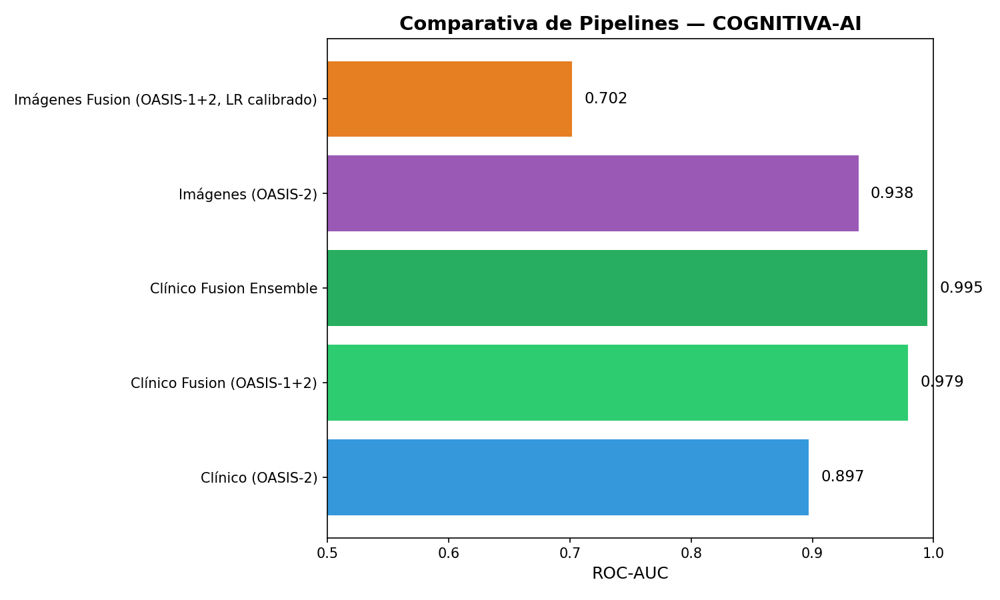

# 🧠 Proyecto de Detección Temprana de Alzheimer (COGNITIVA-AI)

Este proyecto explora la **detección temprana de la enfermedad de Alzheimer** combinando **datos clínicos tabulares** y **resonancias magnéticas estructurales (MRI)** de los conjuntos **OASIS-1 y OASIS-2**.  

El enfoque se diseñó con una idea central: **replicar el razonamiento clínico** usando tanto la información disponible en la historia del paciente (tests neuropsicológicos, edad, educación, volumen cerebral) como en las **imágenes estructurales cerebrales**.  

Se construyeron **cuatro pipelines** para analizar y comparar modalidades:  

1. **COGNITIVA-AI-CLINIC** → ML clásico con datos clínicos (solo OASIS-2).  
2. **COGNITIVA-AI-CLINIC-IMPROVED** → ML clásico con datos clínicos fusionados OASIS-1 + OASIS-2.  
3. **COGNITIVA-AI-IMAGES** → Deep Learning con MRI (solo OASIS-2, ResNet50).  
4. **COGNITIVA-AI-IMAGES-IMPROVED** → *(en progreso)* fusión de OASIS-1+2 en imágenes.  

---

## 📦 Datos y Alcance

- **OASIS-1 (transversal):** 416 sujetos, una sola visita por paciente.  
  - No tiene variable `Group`, por lo que la severidad se deduce a partir de **CDR** (`0=No demencia`, `>0=Demencia`).  

- **OASIS-2 (longitudinal):** 150 sujetos, múltiples visitas.  
  - Tiene variable `Group` (`Nondemented`, `Demented`, `Converted`).  

- **MRI:** archivos `.hdr/.img` por paciente, con segmentaciones asociadas (`FSL_SEG`).  

**Target unificado (binario):**  
- `0 = Nondemented`  
- `1 = Demented` o `Converted`  

> ⚠️ **Control estricto de fugas de información:**  
> - En clínico → seleccionamos **solo la visita baseline** de cada paciente.  
> - En MRI → los splits son estrictamente por **paciente/scan_id**.  

---

# 1️⃣ COGNITIVA-AI-CLINIC (solo OASIS-2)

### 🔧 Decisiones de diseño
- Variables: edad, sexo, educación, SES, MMSE, CDR, eTIV, nWBV, ASF.  
- Preprocesamiento: imputación por mediana en SES y educación, escalado estándar, codificación one-hot.  
- Modelos probados: **Logistic Regression, Random Forest, XGBoost.**  

### 📊 Resultados
- Regresión Logística → **0.912 ± 0.050 (CV)**  
- Random Forest → **0.925 ± 0.032 (CV)**  
- XGBoost → **0.907 ± 0.032 (CV)**  
- Mejor en test: **XGBoost = 0.897 AUC**  

➡️ Primer pipeline sencillo, buen baseline y estable, pero con un dataset limitado (150 sujetos).

---

# 2️⃣ COGNITIVA-AI-CLINIC-IMPROVED (fusión OASIS-1 + OASIS-2)

### 🔧 Decisiones de diseño
El objetivo fue **aumentar la robustez** uniendo ambas cohortes.  
- **Unificación de columnas** (`snake_case`).  
- **Selección baseline** en OASIS-2.  
- **Target unificado:** `Group` (OASIS-2) o `CDR` (OASIS-1).  
- **Imputación:** SES/Educación → mediana.  
- **Codificación y escalado.**  
- **Etiqueta de cohortes** para trazabilidad.  

### 📊 Resultados
- **Hold-out inicial (80/20):** LogReg=1.000 | RF=0.986 | XGB=0.991  
- **Validación cruzada (5-fold):**  
  - LogReg → **0.979 ± 0.012**  
  - RF → **0.974 ± 0.018**  
  - XGB → **0.975 ± 0.021**  

➡️ La fusión de datasets clínicos genera modelos **muy estables y con excelente generalización**.

### ⚖️ Manejo del desbalance
- Distribución real ≈ 54% vs 46%.  
- Estrategias usadas: `class_weight=balanced` y ajuste de **umbral clínico**.  

**Umbral clínico seleccionado (XGBoost):**  
- Recall ≈ 100%, con 15 falsos positivos (77 test).  
- Interpretación → en Alzheimer **un falso positivo es aceptable**, un falso negativo es más crítico.  

### 🩺 Interpretabilidad
- **Coeficientes LR:**  
  - CDR (coef fuerte positivo).  
  - MMSE (negativo fuerte).  
  - Volumétricas con peso menor.  
- **Ablación:**  
  - Sin CDR → AUC = 0.86.  
  - Sin CDR+MMSE → AUC = 0.76.  
  - Sin volumétricas → AUC ≈ 1.0.  

➡️ **Conclusión clínica:** los test **CDR + MMSE son críticos**, las volumétricas aportan menos.  

### 🔧 Calibración y Robustez
- Mejor calibrado: **LogReg + Isotónica (Brier=0.010)**.  
- Nested CV (10x5) → ROC-AUC = **0.985 ± 0.011**.  
- Ensemble (LR+RF+XGB) → ROC-AUC ≈ **0.995**.  

---

# 3️⃣ COGNITIVA-AI-IMAGES (MRI OASIS-2)

### 🔧 Decisiones de diseño
- Preprocesamiento: conversión de `.hdr/.img` a cortes axiales, normalización [0–255], augmentations ligeros.  
- Modelado: **ResNet50** fine-tuning, evaluación por paciente.  

### 📊 Resultados
- **5 slices, sin CLAHE → AUC=0.938 (test)**  
- 20 slices + z-score → AUC=0.858 (más recall, menos precisión)  

➡️ Buen baseline en imágenes, pero dependiente del preprocesamiento y costoso en CPU.

---

# 4️⃣ COGNITIVA-AI-IMAGES-IMPROVED (pendiente)

- Objetivo: fusionar OASIS-1 y OASIS-2 en imágenes.  
- Ventaja: aumentar el número de pacientes y la robustez del modelo.  
- Estado: preprocesamiento de OASIS-1 completado, integración en curso.  

---

# 📊 Comparativa Global

| Modalidad       | Dataset            | Modelo        | ROC-AUC | Notas |
|-----------------|--------------------|---------------|---------|-------|
| Clínico         | OASIS-2            | XGBoost       | 0.897   | Mejor tabular OASIS-2 |
| Clínico Fusion  | OASIS-1+2          | LogReg        | 0.979   | Simple, interpretable |
| Imágenes        | OASIS-2            | ResNet50 (5s) | 0.938   | Mejor en MRI |
| Clínico Fusion  | OASIS-1+2 Ensemble | LR+RF+XGB     | 0.995   | **Mejor global** |

---

# 🚀 Próximos Pasos

1. Finalizar **COGNITIVA-AI-IMAGES-IMPROVED**.  
2. Explorar **fusión multimodal** (clínico + imágenes).  
3. Validación externa con **OASIS-3 / ADNI**.  
4. Publicación académica con énfasis en interpretabilidad clínica.  

---

# 📈 Visual comparativa (AUC)

    - 

---

**Autoría:** Fran Ramírez  
**Año:** 2025

